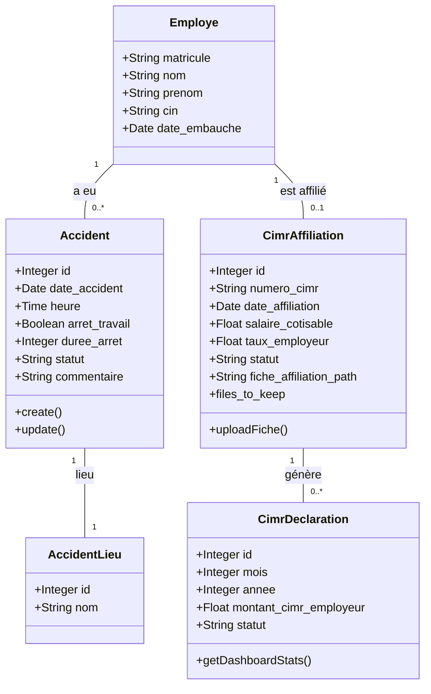
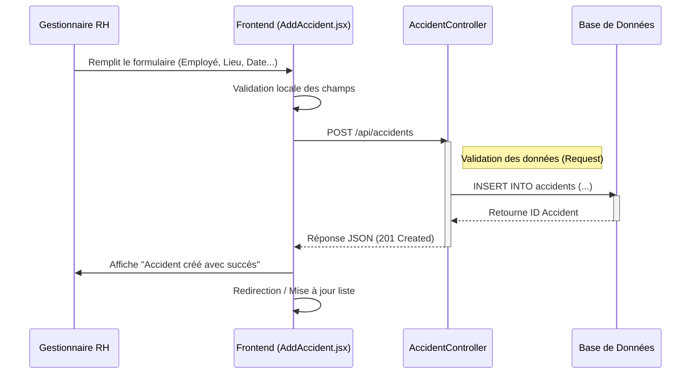
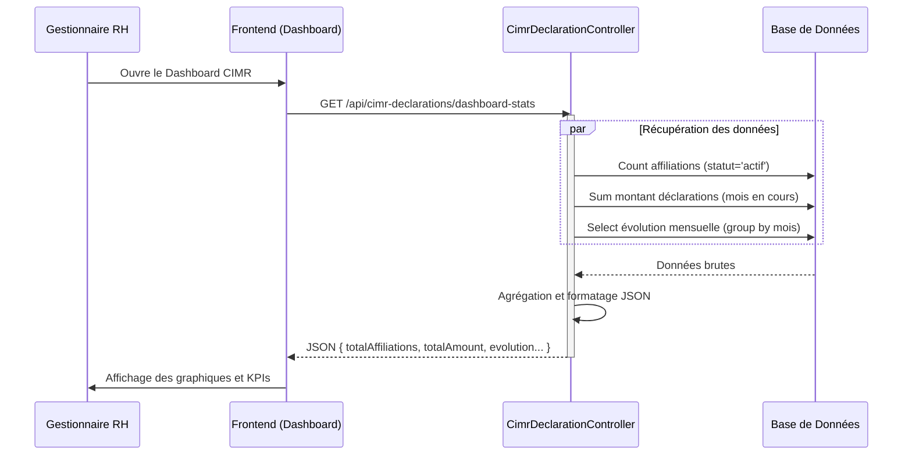

# Spécifications Fonctionnelles et Techniques - Gestion RH (Accidents & CIMR)

Ce document décrit le fonctionnement des modules "Accident de Travail", "Affiliation CIMR" et "Déclaration CIMR" d'une application de gestion RH. Il inclut également les diagrammes UML correspondants (Use Case, Classe, Séquence).

## 1. Description du Fonctionnement

### A. Gestion des Accidents de Travail
Ce module permet aux responsables RH de suivre les incidents survenant sur le lieu de travail.
*   **Déclaration d'accident** : L'utilisateur enregistre un nouvel accident en renseignant les informations de l'employé (nom, matricule), les détails de l'incident (date, heure, lieu, type, nature) et les conséquences (arrêt de travail, durée).
*   **Suivi du statut** : Chaque dossier d'accident possède un statut (« En cours », « Déclaré », « Clôturé ») permettant de suivre son avancement administratif.
*   **Gestion des lieux** : Une liste prédéfinie de lieux d'accidents (Atelier, Bureau, Zone...) est gérée dynamiquement pour standardiser la saisie.
*   **Tableau de bord** : Visualisation rapide du nombre total d'accidents et des accidents du mois en cours.

### B. Affiliation CIMR (Caisse Interprofessionnelle Marocaine de Retraite)
Ce module gère l'adhésion des employés à la retraite complémentaire.
*   **Gestion des dossiers** : Création d'une fiche d'affiliation pour un employé avec ses informations contractuelles et spécifiques à la CIMR (Numéro d'affiliation, Taux employeur, Salaire cotisable).
*   **Statut d'affiliation** : Gestion de l'état de l'affiliation (« actif » ou « suspendu »). Seuls les employés actifs sont éligibles aux déclarations.
*   **Gestion documentaire** : Possibilité de téléverser et stocker les fiches d'affiliation scannées (PDF/Images) directement dans le dossier.

### C. Déclaration CIMR
Ce module permet le suivi périodique des cotisations.
*   **Suivi mensuel** : Enregistrement et suivi des déclarations mensuelles pour les employés affiliés.
*   **Tableau de bord analytique** :
    *   Nombre total d'affiliations actives.
    *   Montant total déclaré pour le mois courant.
    *   Évolution mensuelle des montants (graphique sur 6 mois).
    *   Répartition des statuts de déclaration.
*   **Éligibilité** : Identification automatique des employés à déclarer basée sur leur statut d'affiliation actif.

---

## 2. Diagrammes UML

### Diagramme de Cas d'Utilisation (Use Case)

```mermaid
usecaseDiagram
    actor "Gestionnaire RH" as User

    package "Accidents de Travail" {
        usecase "Déclarer un accident" as UC1
        usecase "Suivre le statut (En cours/Clôturé)" as UC2
        usecase "Gérer les lieux d'accidents" as UC3
        usecase "Visualiser les stats Accidents" as UC4
    }

    package "Gestion CIMR" {
        usecase "Créer une affiliation CIMR" as UC5
        usecase "Uploader la fiche d'affiliation" as UC6
        usecase "Gérer le statut (Actif/Suspendu)" as UC7
        usecase "Consulter le Dashboard CIMR" as UC8
        usecase "Suivre les déclarations mensuelles" as UC9
    }

    User --> UC1
    User --> UC2
    User --> UC3
    User --> UC4
    
    User --> UC5
    User --> UC7
    User --> UC8
    User --> UC9

    UC5 ..> UC6 : <<include>>
    UC8 ..> UC9 : <<extend>>
```

### Diagramme de Classes (Class Diagram)



### Diagramme de Séquence : Déclarer un Accident



### Diagramme de Séquence : Dashboard CIMR (Analytics)


